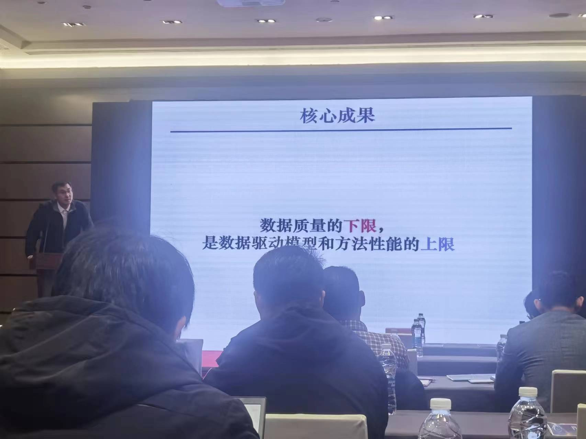
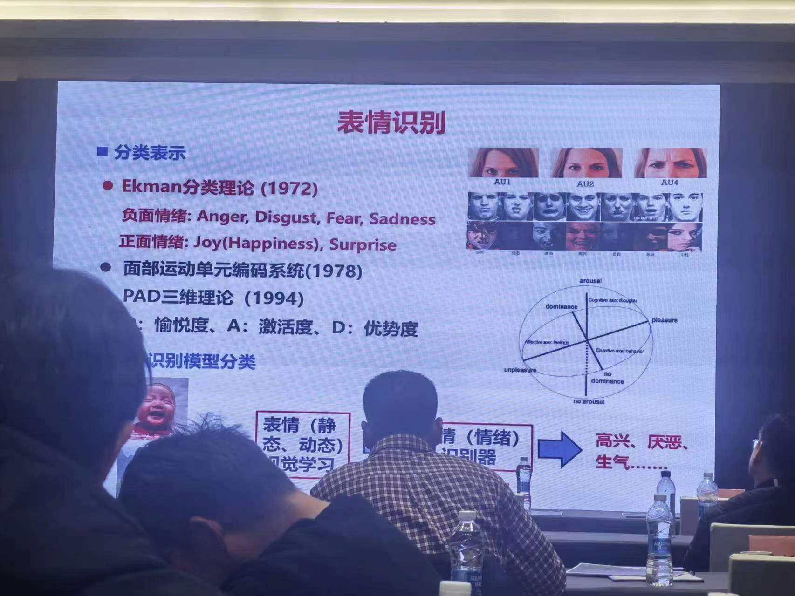
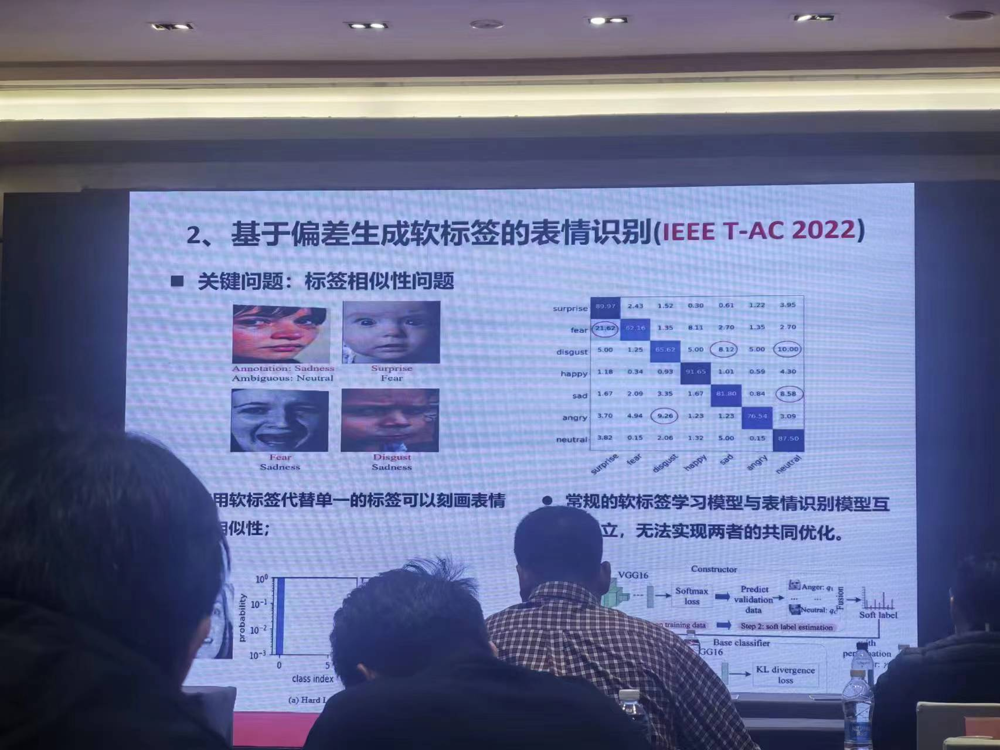
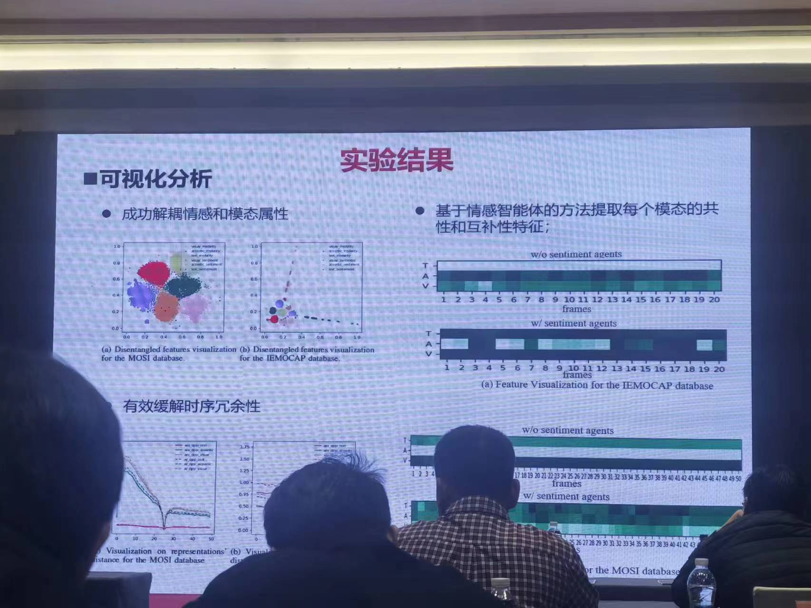

近期参加了2023安徽省智能计算论坛, 在此记录一下收获与感悟.
## 物联网
- 数据质量的下限, 是数据驱动模型和方法性能的上限 

## 可解释性
- AI的可解释性问题
- 相比于纯数据驱动的方式, 知识+数据的方式generalization更强. 知识引导的深度学习模型是在大模型时代多重知识表达的一种实践

## 普适方法存在吗?
- Lucas-Kanade tracking 可微->加入网络中
	○ "现在的学生已经不懂啦 因为他们只会调调参嘛"
- 视觉是情感表达的重要载体 55%表情动作+38%语音语调+7%语言内容
	○ 当一个人说话的语调, 面部表情和肢体语言, 与其说话的内容不一致时, 人们倾向于相信语调, 面部表情与肢体语言, 而不是他们所说的话

## 情感计算
- 硬标签 🐱(1, 0), 🐕(0, 1)
- 软标签 🐱(0.7, 0.3), 🐕(0.3, 0.7)

下面这张图配色选的我挺喜欢haha

## 圆桌
- 圆桌: 面对新一轮AI发展机遇, 如何整合各方资源, 加强产学研深度融合, 助推AI产业发展?
	1. 顶层设计
	2. 企业经历, now 产业界引领学术界发展
        - 海量数据
        - 计算资源
