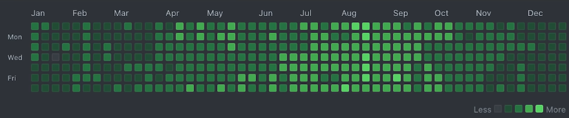

> "如果你每天都有完成一些事情, 并且尝试去记录, acknowledge这些小小的难度, 很快就会提升自己内在的能力, 生产力和创造力."
> 
> ----The Program Principle

## 一篇Paper的结构
标题, 摘要, 介绍, method, exp, conclusion

不必要总是从头读到尾, 需要快速精读.

## 李沐之三遍读论文法

### pass 1: 读标题, 摘要, 读结论

首先看标题可以看出这篇文章的主题跟我的方向是否相关, 有没有阅读的必要.再读摘要, 搞清楚这篇文章大致讲了个什么事情, 可能摘要中会抛出几个`issue`. 这些`issue`都会在`conclusion`部分得到解决.

然后跳过主干内容, 直接去读`conclusion`, 这一part跟`abstract`大致是一样的, 但是会通过一些数据有力地回答abs中的issue.读完这三个部分之后, 大致就知道了这篇paper在讲什么东西.

这时可以到主干部分去看一些主要的图, 概览method框架. 再看一些主要的表, 与`pre-sota`比性能提升了多少.
这一部分大概要花约10min时间, 去弄清这篇文章的质量. 然后来决定这篇文章要不要读下去, 还是放到一边.

结论回答了摘要的一些问题, 再看一些`exp`和`graph` 看整个paper的**质量**.

### pass 2: 全部浏览文章.

搞清楚重要的图和表都是做什么. x轴, y轴.... 与sota对比分析.

作者对已有文献的改进, 圈出重要的参考文献. 读一下 降低这篇文章的门槛.

第二遍读是要整个文章过一遍, 然后知道每一part是在做什么.公式证明和细节可以暂时忽略, 但要搞清楚重要的图、表的所有细节, 比如流程图, 算法图等等.

可以把其中相关的文献圈出来, 比如作者说我们是做某一个问题, 是从xxx的问题上做的解决方案, 是从xxx的方法上做的优化和提升. 其中有些重要的文献, 我要去看下我是否读过, 评估一下是否有读的必要.

### pass 3: 搞清楚每句话, 每一段在说什么.

第三遍是最详细的一遍, 读的时候就好像作者在实现, 重复这篇文章.代入作者视角, 如果是我来做这个事情该怎么办. 能不能比他做的更好.

作者未完成的任务, 如果我来做, 是否有方法去做解决. 这样之后我们在做研究的过程中, 涉及到这篇文章时能够以最短的时间复述它的工作.

## 提高Reproduce Code的能力

### 1. 每天一个PR(Pull Request)

将大的Project拆成N个小的Project, 每天都有可以量化的`micro progress`.

首先, 化繁为简本来就是一个很好的习惯. 因为大的`request`是很难去review的. 小的`request`就会更让别人有review的想法, 这样就可以获得更多的`feedback`. 

## ReLU

ReLU函数其实是分段线性函数，把所有的负值都变为0，而正值不变，这种操作被成为单侧抑制。可别小看这个简单的操作，正因为有了这单侧抑制，才使得神经网络中的神经元也具有了**稀疏激活性**.

也有很多更好的激活函数, 但是十年来大家用的最多的还是ReLU. 归根到底就是因为ReLU足够简单, 这是奥卡姆剃刀在计算机科学中的又一次胜利.
