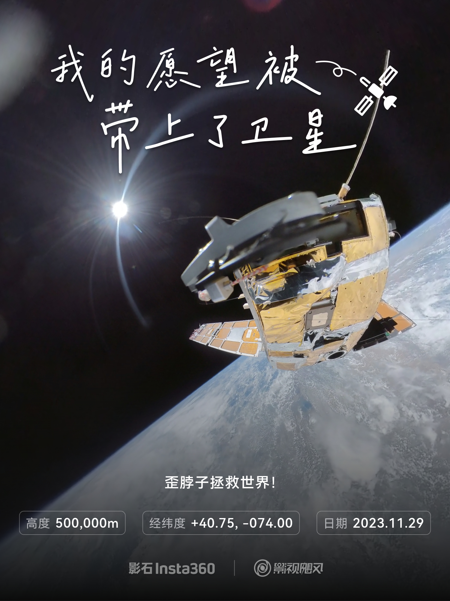

## "做选择的人才有主动权."

别人抛出问题的时候, 你要有自己的想法, 而不是一味的去迎合别人的想法. 你要有自己的想法, 你才有主动权.

## 要勇敢的走出自己的舒适区.

## 反PUA(Pick Up Artist)主义

## 影石Insta360 & 影视飓风的卫星!

## 一些荒诞的idea :smile:

:robot: 真的有高级智慧生物在实验整个宇宙吗?

假设整个宇宙的初始参数分两部分, 一部分决定了自然科学, 一部分决定了社会科学. 自然科学的部分就无非是苹果会从树上往下落, 气球会往天上飞...而社会科学就是类似《基地》系列中谢顿的心理史学, 大规模群体所表现出的必然行为.
